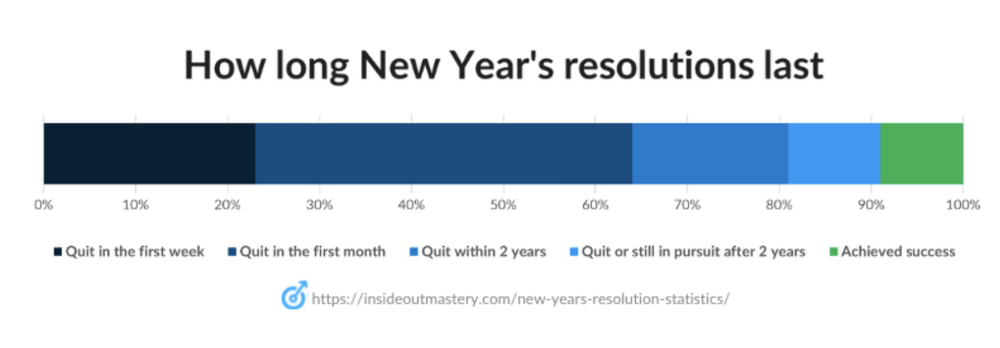
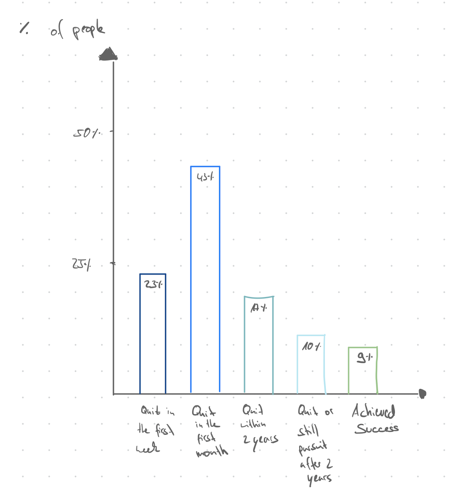
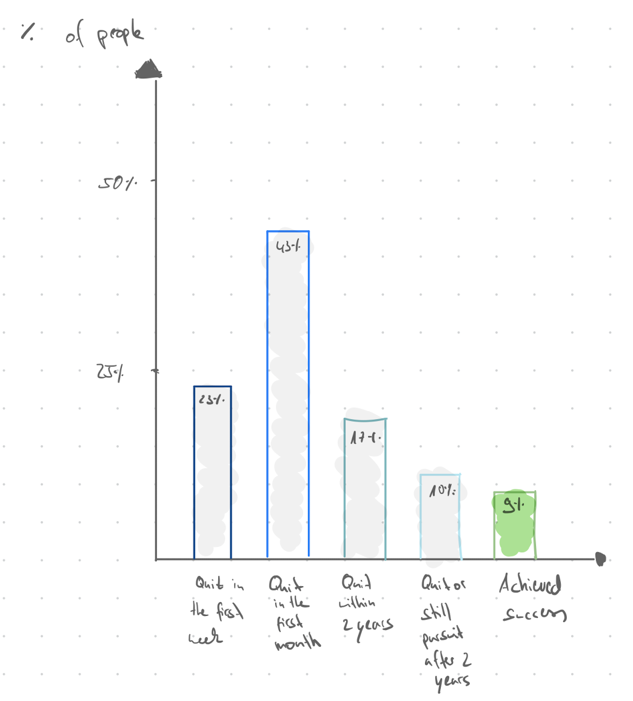
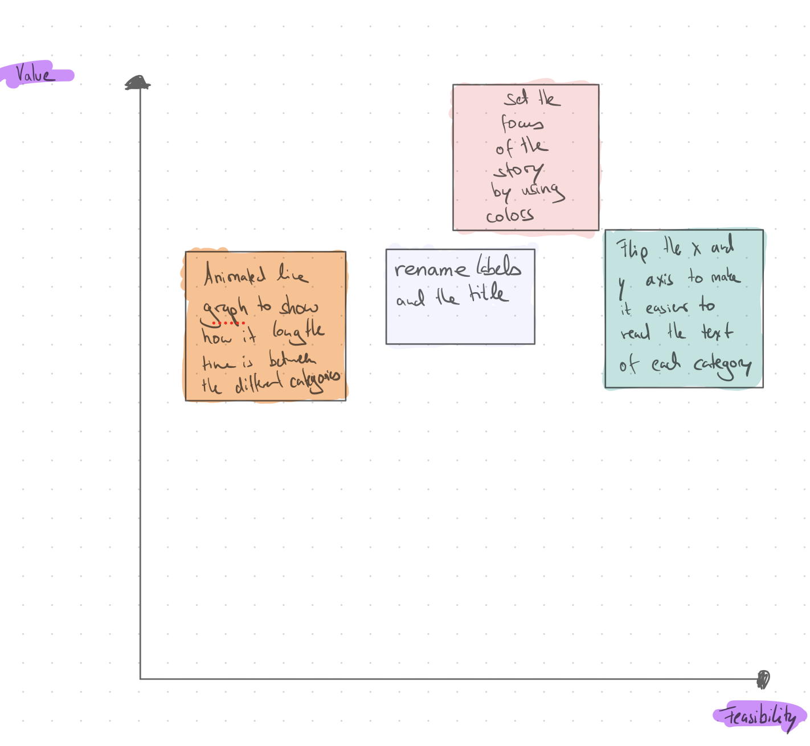
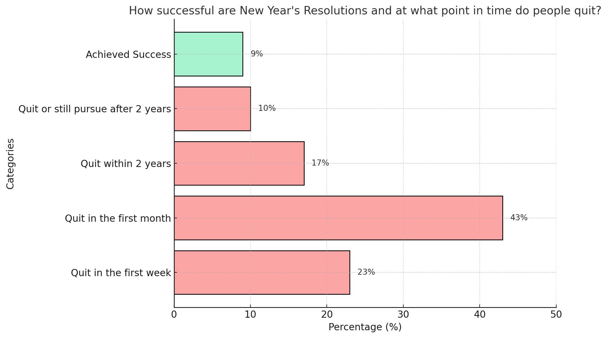

| [home page](README.md)| [data viz examples](data-viz.md) | [critique by design](critique-by-design) | [final project I](final-project-part-one.md) | [final project II](final-project-part-two.md) | [final project III](final-project-part-three.md) |

# Critique by Design - New Year's Resolution

## Step one: the visualization

I selected this data source from Make over Monday, as it seemed interesting to me to better understand New Years Resolutions with some data about it. Most my friends made New Years Resolutions and I am not a big fan of the concept as I believe goals can be and should be set through out the year and should be small enough to be actually achievable. 

The specific chart was chosen because it was interesting data but not perfectly presented and I saw an opprtunity for improvements. 

Source: Inside Out Mastery, 2022, 19 Surprising New Year’s Resolution Statistics (2024 Updated), https://insideoutmastery.com/new-years-resolution-statistics/ , Accessed on 10/02/2025

## Step two: the critique
### Positive Aspects of the Graph
- Relevant Title: The title aligns well with the subject matter of the graph.
- Legend: Includes a clear legend explaining which color represents each category.
- Scale: A scale is provided, allowing for a rough understanding of the share of each category.
- Source Link: The graph includes a source link for the data beneath the chart.
- Color Palette: A pleasing color palette is used, transitioning from dark blue to green, where green represents a successful New Year's resolution.

### Critiques and Suggestions
- Chart Type: The stacked bar chart is not an appropriate choice; a regular bar chart would improve readability. It makes it difficult to compare the sizes of each category.
- Visual Quality: The graph is blurry and should be uploaded with higher resolution.
- Source Link Accessibility: The source link is not clickable, which limits user interaction.
- Color Contrast: The colors for "quit in the first week" and "quit within the first month" are not distinct enough and can be hard to differentiate.
- Chart Placement: The chart should be presented first, with explanatory text following. Ideally, the graph should be self-explanatory so that accompanying text is unnecessary.
- Content Alignment: The article’s purpose is to help readers with New Year’s resolutions and provide actionable insights on achieving them. This goal becomes clear only at the end of the article but should be evident earlier. The graphs focus on challenges (e.g., quitting resolutions early), which aligns with the theme but fails to provide direct solutions or actionable advice.
- External Links: The article redirects readers to additional content, such as: an article on books for setting and achieving goals; a website promoting a costly planner for tracking goals. These links feel promotional and do not directly help readers achieve their goals within the article itself.

### Improvements to Achieve Clarity and Usability
- Add actionable advice or recommendations directly within the article rather than solely redirecting to external resources.
- Represent data in a dfferent data chart type that provides better readability (e.g., regular bar chart).
- Use more distinct colors for easier visual differentiation.
- Make the source link clickable for user convenience.
- Enhance the chart resolution for better visual quality.
- Reorganize content so that the goal of helping users with resolutions is clear from the beginning.

## Step three: Sketch a solution

Original Sketch:

In Class Improvements based on Feedback:

## Step four: Test the solution

_Before you conduct your interviews, prepare a simple script.  Use this as a guide and as a way to take notes as you go forward. Come up with your own list of questions you want to ask for the selected visualization. Keep the questions broad so you can get the most value out of your feedback. Then, document answers to your questions here._

#### Questions I asked:

- Can you tell me what you think this is?
- Is there anything you find surprising or confusing?
- Is there anything you would change or do differently?
- Do you have an idea for an alternative way to visualize the data?

#### Interviewed People

Person 1: 
- Master in Management Arts
- End 20's
- Work experience in research
  
Person 2: 
- Master in Management and Information Systems
- Work experience in Banking
- End 20's

Person 3:
- Master in Public and Policy Management
- Mid 20's
- Work experience with customer service, legal research, and administrative skills

#### Results: 

| Question | Interview 1 | Interview 2 | Interview 3 |
|----------|-------------|-------------|-------------|
|Can you tell me what you think this is?|I think this chart shows how hard it is for people to stick to their resolutions. It's inspiring that at least 9% of people manage to achieve success, but it's clear that many struggle early on.|It tells me most people give up quickly. The 43% quitting within the first month doesn't surprise me.|It's surprising to see such high early quit rates, especially the 23% quitting in the first week—that's almost 1 in 4 people.|
|Is there anything you find surprising or confusing?|Not really| For me it is not completly clear what the story is.|Everything is clear.|
|Is there anything you would change or do differently?| I would maybe change the X an Y axis, due to the long labels.| I would use colors to set a focus color the bars gray except for the one where to focus should lie.| Maybe adjust story and then set the focus in the chart based on that, as the story from the original website is not that specific.|
|Do you have an idea for an alternative way to visualize the data?| Not really. | Another way to visualize it could be by drawing a timeline and going from 100% down to the 9% who keep their New Year's Resolution. | It really depends on the story you want to tell. I think the histogramm works well if you want to show at what point how many people keep going with their New Year's Resolution. Otherwise you might want to use a pie chart and color code how many people are successfull in green and the other shares in gray.|

#### Synthesis: 

All my intervieweees understood the context of the graph very quickly. The feedback still varied though. They had different ideas, which is very interesting but also showed that there is not one aspect which the all thought needs to changed. Some of the comments make a lot of sense for me and I would like to incorporate them. 

I would like to flip the x and y axis and I would like to set the focus of the story on how few people really succeed and why New Years resolutions are a little over hyped. For that I want to change the title and use colors accordingly. 

Prioritization Matrix

## Step five: build the solution

I have used my initial sketches to receive feedback on my idea for an improved version and I have implemented some of the Feedback I have received. I have created the chart with GenAI (ChatGPT), as the data from YouGov was in a PDF file and DataWrapper as well as Tableau could not create my envisioned chart based on the available data set structure. I used the following prompt to create the chart: 
- Can you create a graph based on the following information? Please create a bar chart (histogram) where the y-axis displays the labels, and the bars start from the x-axis, which shows a percentage scale. Please color-code the bars in pastel red, except for the bar that represents "Achieved Success." 23% quit in the first week. 43% quit in the first month. 17% quit within 2 years. 10% quit or are still pursuing. 9% achieved success. The bar for "Achieved Success" should be colored in pastel green. The title of the chart should be: How successful are New Year's Resolutions, and at what point in time do people quit?

The feedback I have received allowed me to create a much better version of the redesign without getting the feedback. It really helped me. The process seemed quite time intensive initially, but the output is also much better in comparison to directly redesigning it without sketcking and interviews.

Source: YouGov Survey Results, 2024, https://ygo-assets-websites-editorial-emea.yougov.net/documents/YouGov_-_New_Years_resolutions_2024.pdf , Accessed on 10/02/2025

## References

Inside Out Mastery, 2022, 19 Surprising New Year’s Resolution Statistics (2024 Updated), https://insideoutmastery.com/new-years-resolution-statistics/ , Accessed on 10/02/2025

YouGov Survey Results, 2024, https://ygo-assets-websites-editorial-emea.yougov.net/documents/YouGov_-_New_Years_resolutions_2024.pdf , Accessed on 10/02/2025

## AI acknowledgements

I used AI to create out of my observations/critique text, I posted in the google form to bullet points. It was also used to create the graph as Tableau didn't manage to read the data file as it was a very unorganized PDF file and it was much easier to do with a GenAI tool. 

