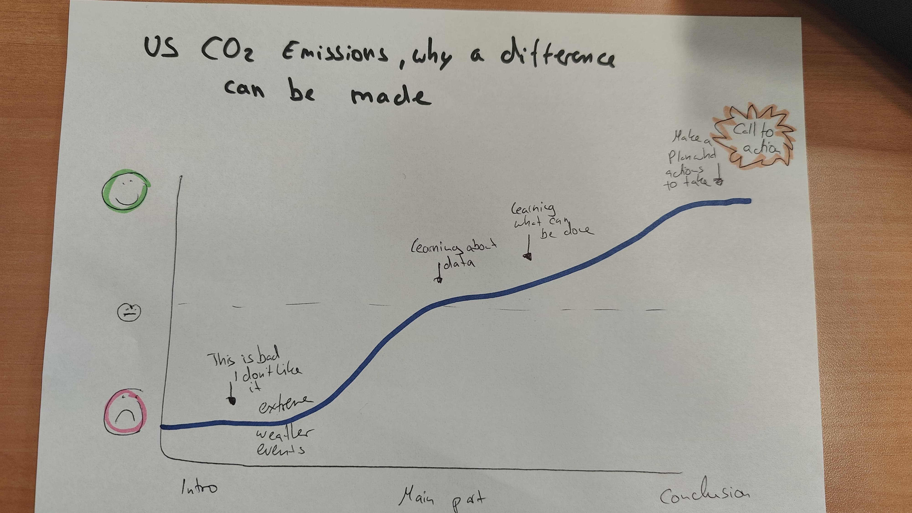

| [home page](README.md)| [data viz examples](data-viz.md) | [critique by design](critique-by-design.md) | [final project I](final-project-part-one.md) | [final project II](final-project-part-two.md) | [final project III](final-project-part-three.md) |

# Outline

### High Level Summary
With this project, I aim to educate Students in the US about CO2 emissions and the current situation of the US in comparison to other countries. I hope to inspire others to take actions for example by inspiring them to talk to others and educate them to make them aware of the current status. The aim is to present the data in such a way that it becomes clear how urgent the issue of climate change is, but also what opportunities arise from it and how we can deal with this matter and what actions other countries and organizations implement and what influence they have. I want to make the subject approachable for everyone. I want to keep it simple and want to try to keep it objective based on available data.
 

### Project Structure
This section describes my planned project structure. This is also visually shown in the sketch attached below, that shows the result of my inclass exercise for the development of the story.

#### Introduction 
In this part, I want to provide context about where we are currently, showing pictures of the recent wildfires in California and pictures from the tornados Florida experienced last year. Since I want to work with comparisons between the US and Germany, I also aim to provide pictures from floods in Germany. Another idea is to use newspaper headlines from the past year to remind people of previous climate change related events, according to scientists. I aim to make the subject relatable and approachable for all students, no matter what background they have. The aim is here to really show the impact of severe weather events and changes in the climate.

#### Rising Tension
This part will introduce the audience to some key terms before diving into the data. In this section I will focus on introducing data and showing trends by showing the development of CO2 emission in the US, the World and Germany. I might also show China, as I have received the feedback that some people have heard that China emits so much CO2 emissions that US doesn’t really make a difference. I want to make clear that the US actually makes a difference. Not only that, but I want to highlight current challenges and gaps in actions towards a reduction of CO2 emissions.

#### Climax 
In this section, I want to show why it is not too late yet and show what other countries are doing to reduce CO2 emissions. The aim is to show with data where there is the biggest opportunity for CO2 emission reductions and what policies could be implemented to reduce emissions.

#### Resolution/Call to action
I want people to feel inspired and educated about CO2 emissions. Additionally, they should know what role the US plays worldwide. Furthermore, I aim to create a feeling of “we are in this together and what we do matters”. For me, it is very important to not put a shame on anyone or anything, but rather create a vision in how it could like and what could change if more people have knowledge about CO2 emissions and reduce smattering knowledge. I want to show what opportunities there are for the US and want to provide three main takeaways for students of what they could do based on their new knowledge if they would like to.

## Initial sketches
I have created one sketch with some ideas I have. Additionally, I have already played with Tableau a little bit and came up with the following charts.

<noscript></noscript><object class='tableauViz'  style='display:none;'><param name='host_url' value='https%3A%2F%2Fpublic.tableau.com%2F' /> <param name='embed_code_version' value='3' /> <param name='site_root' value='' /><param name='name' value='Co2Emisssions_17387071102370&#47;GermanyvsUSACo2Emissions' /><param name='tabs' value='no' /><param name='toolbar' value='yes' /><param name='static_image' value='https:&#47;&#47;public.tableau.com&#47;static&#47;images&#47;Co&#47;Co2Emisssions_17387071102370&#47;GermanyvsUSACo2Emissions&#47;1.png' /> <param name='animate_transition' value='yes' /><param name='display_static_image' value='yes' /><param name='display_spinner' value='yes' /><param name='display_overlay' value='yes' /><param name='display_count' value='yes' /><param name='language' value='en-GB' /><param name='filter' value='publish=yes' /></object>
                

<noscript></noscript><object class='tableauViz'  style='display:none;'><param name='host_url' value='https%3A%2F%2Fpublic.tableau.com%2F' /> <param name='embed_code_version' value='3' /> <param name='path' value='shared&#47;J9DRQ83DF' /> <param name='toolbar' value='yes' /><param name='static_image' value='https:&#47;&#47;public.tableau.com&#47;static&#47;images&#47;J9&#47;J9DRQ83DF&#47;1.png' /> <param name='animate_transition' value='yes' /><param name='display_static_image' value='yes' /><param name='display_spinner' value='yes' /><param name='display_overlay' value='yes' /><param name='display_count' value='yes' /><param name='language' value='en-GB' /><param name='filter' value='publish=yes' /></object>
                

<noscript></noscript><object class='tableauViz'  style='display:none;'><param name='host_url' value='https%3A%2F%2Fpublic.tableau.com%2F' /> <param name='embed_code_version' value='3' /> <param name='site_root' value='' /><param name='name' value='Co2Emisssions_17387071102370&#47;Sheet23' /><param name='tabs' value='no' /><param name='toolbar' value='yes' /><param name='static_image' value='https:&#47;&#47;public.tableau.com&#47;static&#47;images&#47;Co&#47;Co2Emisssions_17387071102370&#47;Sheet23&#47;1.png' /> <param name='animate_transition' value='yes' /><param name='display_static_image' value='yes' /><param name='display_spinner' value='yes' /><param name='display_overlay' value='yes' /><param name='display_count' value='yes' /><param name='language' value='en-GB' /><param name='filter' value='publish=yes' /></object>
                

# The data

I have identified different sources of publicly available data about CO2 emissions, per country, per capita and even origin of CO2 emissions with data ranging from 1988 to 2021. In the following table you can find three data sources that I will be using for this project. The data from climate watch is very useful to understand which country emmitts and has emitted how much CO2 emisssions. This data is very essential for my Analysis especially because I want to show that the US has a big impact when looking at worldwide emisssions. Additionally this data allows me to compare Germany with the US. 

The second data source is from the OECD organisation and provides information about policies related to environmental protection. This will be a good addition to the other data sources to understand what countries are currently doing and understand if those policies are effective by comparing the date of the start of a new policiy with the development of CO2 emissions of the countries. 

My third data source (EDGAR, European Comisssion)is very useful to look into specific aspects of CO2 emissions per country e.g. transport, fossil fuels, etc.. It provides information on a country level. This will help to understand where the biggest opportunities are for different countries. I am particulatly interested to analyse this for the US.

Those datasets are valuable but they cannot be directly imported to Tableau as the format does not match with the format tableau requires. For example the data from ClimateWatch was in a table format where the headers are years. For Tableau we need the year to be written in the same row as a data point. Therefore, I have done some adjustments to the structure of the data by using a Python script. During the development of this project I might require more data. Therefore, it is likely that more resources will be required. 

| Name | URL | Description |
|------|-----|-------------|
|Climate watch data | https://www.climatewatchdata.org/data-explorer/historical-emissions?historical-emissions-data-sources=climate-watch&historical-emissions-gases=all-ghg&historical-emissions-regions=All%20Selected&historical-emissions-sectors=&page=1 |"Climate Watch offers open data, visualizations and analysis to help policymakers, researchers and other stakeholders gather insights on countries' climate progress" (ClimateWatch, Accessed 03/02/2025)|
|OECD | https://oecd-main.shinyapps.io/pinedatabase/ | It is a data dissemination platform of the OECD Policy Instruments for the Environment (PINE) database (OECD, Accessed 03/02/2022)|
|EDGAR - Emissions Database for Global Atmospheric Research | https://edgar.jrc.ec.europa.eu/report_2022?vis=pop#emissions_table | "EDGARv7.0 launches the community GHG emissions database, changing to IEA CO2 data to harmonise CO2 emission estimates and beginning a process of recognising the essential role of the providers of the underlying international statistics to EDGAR." (EDGAR, Accessed 03/02/2025)             |

# Method and medium

I am planning to utilize shorthand and Tableau Desktop, as well as Tableau Prep. Additionally I will reformat the CSV file with Python scripts if necessary. Since I have not worked with ArcGIS story maps, I will not use it. Additionally I would like to use stock pictures from my envato account. It is a subscription based platform through which I can download pictures which I can license for projects.

## References
ClimateWatch, https://www.climatewatchdata.org/, Accessed on 04/02/2025

EDGAR, CO2 emissions of all world countries, 2022, https://edgar.jrc.ec.europa.eu/report_2022?vis=pop#emissions_table, Accessed on 04/02/2025

OECD, Pine at a glance, 2024, https://oecd-main.shinyapps.io/pinedatabase/, Accessed on 04/02/2025
