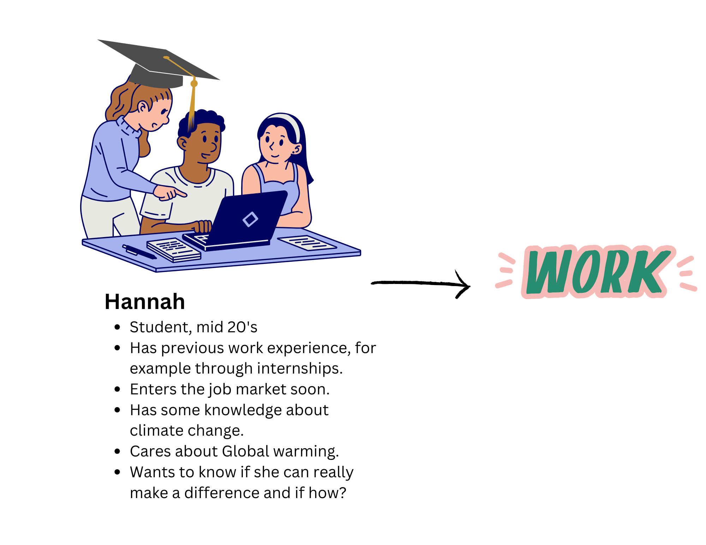

| [home page](README.md)| [data viz examples](data-viz.md) | [critique by design](critique-by-design.md) | [final project I](final-project-part-one.md) | [final project II](final-project-part-two.md) | [final project III](final-project-part-three.md) |

# Wireframes / storyboards
I have further developed my project directly in shorthand. As you can see in shorthand my story is much more specific and narrowed down than part one. I have changed the focus sligthly. While creating the shorthand website I continued to follow my storyline mood chart that we drafted in class going from the Intro part to the current state, opportunities to the solution. The story unfolds, as we learned it in class from conflict over context to resolution applying the guideline SIX of the workbook good data viz.

The link to shorthand preview: [https://preview.shorthand.com/zEBW7PtLeP5rkMEk](https://preview.shorthand.com/zEBW7PtLeP5rkMEk)

# User research 
For my user research I started thinking in more depth about my target audience and from that started developing my interview script and who I want to interview. The interviews were very valuable and I was able to identify opportunities for improvement based on their input.  

## Target audience
Initially I really struggeled to narrow down the subject and focus on just one target audience. Therefore, I spent a lot of time in specifying my subject so it is specific for a specific group. I decided to develop a story for students more specifically students which are about to graduate within a year. My story is focusing on the impact a job decision has to use your resources towards achieving 1.5 degrees global warming. 
The approach included a lot of brainstorming I thought about different directions this project could go into but decided I really wanted to focus on students and create a call to action which has a strong message and is also hopefull.

### User persona

### Identify representatives of the target audience
I used the opportunity to interview people within the telling stories with data class, as they are my target audience. Additionally, I interviewed my flatmates which are seniors at CMU. They are planning to enter into the workforce soon.

## Interview script
In the following table I have listed down the questions I planned to ask my interviewees with the corresponding goal. Overall I was trying to develop questions which help me develop a better story and compelling data visualisations. 

| Goal | Questions to Ask |
|------|------------------|
|Ensure that the story is clear or if any changes are required. |Is there anything confusing or unclear about the story?|
|Identify if I can add arguments and charts to convince my target audience. |What would motivate you to take actions in the directions of this story?|
|Receive more ideas for my story and ensure it is relatable to my target audience.|Do you have suggestions for making the story more compelling or relatable?|
|Identify what visualizations should be part of my final presentation with shorthand and which one would be a nice addition as context for my github page.|What data visualizations would you look for in this story?|

## Interview findings

#### Interviewed People

Person 1: 
- Master in in Public and Policy Management
- End 20's
- Work experience in research
  
Person 2: 
- Bachelor in Stage Management
- Beginning 20's
- Internship experience

Person 3:
- Master in Public and Policy Management
- Mid 20's
- Work experience with an NGO

| Questions               | Person 1 | Person 2 | Person 3 |
|-------------------------|--------------------------------|-------------|-------------|
|Is there anything confusing or unclear about the story? |No, it is very clear.| No, it is a really good set up for the story.|Overall it is clear, just one thing I would wish for is that the headers are insightfull enough to understand what it is about without needing to read the paragraph below.|
|What would motivate you to take actions in the directions of this story? |A list of firms which are doing really well in regards to reducing their Co2 emissions. So it is easy for me to keep an eye out for them, when doing my job search.|I would love to have an interactive section where I can click on buttons and receive more information about specific firms.|It would be great to get access to a website which shows how every company in the U.S. ranks so that I can check the score of a potential future employer.|
|Do you have suggestions for making the story more compelling or relatable? |Use pictures very intentional some pictures aren't that strong yet.|Use very simple terminologies or explain the terms to make it easily understandable.|Use the colors consistently you are using majorly dark colors at the beginning and more bright colors towards the end of the presentation, but it is not completly consistent yet.|
| hat data visualizations would you look for in this story?|It would be grat to have a visualisation that compares the best vs. the worst company regarding CO2 emission.|I think it is really important that the charts are simple and clear in its message similar to the charts we saw in the Explained documentaries from Netflix.|Trendlines could be usefull to show some trends also between countries. It might also be interesting to compare how companies are performing regarding their efforts towards reducing emissions and how they communicate it on their websites.|  

I was worried that my story isn't clear or that the topic is not from interest for my target audience. The interviees showed great interest into the topic and shared that the topic is very relatable for them. The feedback I received was majorly in regards to making it more compelling and getting further idear for my designs.I found some commonalities and some differences between the responses of my interviewees.

# Identified changes for Part III

I have identified opportunities for changes to make my final story more compelling. Since we had the chance to receive feedback twice. I was already able to implement some of the feedback I received into my shorthand website. I have made changes to the coloring and the selected pictures. Thee feedback I have not been able to implement yet and plan to do over the next week is regarding data visualisations and adding interactive elements into my website e.g. through providing links to websites with additional information. 

| Research synthesis                       | Anticipated changes for Part III                                                |
|------------------------------------------|---------------------------------------------------------------------------------|
|Use of colors is inconsistent.|I have already started working on this but I am planning to spend more time on streamlining the use of color in my story. Going from a more dark color scheme to a brighter color scheme when the story unfolds.
|Pictures are not used to its full potential to make the story compelling.|Use appropriate pictures to each section in the story. I already made some changes e.g. initially I had a picture of a young girl as the background to the call to action and changed it to a picture that is more specifically showing students which are graduating. More changes are planned. So far I have only used the stock pictures from shorthand, but I want to also make use of the subscription I have with envato, where I have access to more stock pictures.|
|Create simple and insightfull charts to support the story.|Spend more time on developing good charts either with Tableau or with GenAi depending on how important the interactive part of a chart is. When the interactive part is essential I will use Tableau and if it is less important create graphs with AI tools based on drafted charts in Tableau.|
|Some kind of ranking of companies in the U.S. would be extremly usefull.|I will do further research on data sources to identify if anything like this exist or if there is a possibility for me to create a ranking based on available data. It does not look too promising yet though. It is much easier to get this information about companies which operate in a countrie that is part of european union as they have much stronger regulations on sustainability reporting when listed on the stock market.|
|Interactions with the website through buttons.|I will add buttons where appropriate.|

There is still a lot do in regards to the data vizualisation, majorly because I adjusted the focused point of my story only this week. I believe when I incorporate the feedback I will be able to tell a compelling story with a strong call to action. 

## References
ClimateWatch, https://www.climatewatchdata.org/, Accessed on 04/02/2025

EDGAR, CO2 emissions of all world countries, 2022, https://edgar.jrc.ec.europa.eu/report_2022?vis=pop#emissions_table, Accessed on 04/02/2025

OECD, Pine at a glance, 2024, https://oecd-main.shinyapps.io/pinedatabase/, Accessed on 04/02/2025

## AI acknowledgements
I have not used AI for this part of my final project. I am planning to use GenAi to create some of my vizualizations for my final delivery. 

